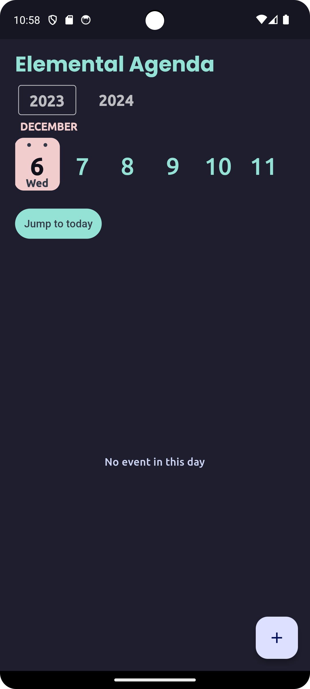

# Elemental-Agenda

Mobile Computing (ASU Fall 2023) Project 4 for Group 21

## Screenshots




## About the application

Elemental Agenda is a context aware meeting scheduling application which takes the surrounding weather and location data into account and gives suggestions about possible changes to the meeting in suggestion box

## Technologies used

[Flutter](https://flutter.dev/) - Android Application development framework made by Google using dart, we used it for clean UI and easy collaboration strategies
[Flask](https://flask.palletsprojects.com/en/3.0.x/) - Python library for creating backend. Used for easy integration with other python code we had. 

## Final application

Delivered android apk based on the target platforms (to keep size lower). Can be found at build directory of root

## How to run application from source

### Running the backend:

To run and check the server code in the backend folder follow these steps - 

1. make a virtual environment using python 3 (Make sure python is installed, or you can download it from [official] ) 
(Linux or macOS)
```
python3 -m venv <environment_name>
```
(Windows)
```
python -m venv <environment_name>
```

2. Activate the environment 

(Linux or macOS)

```
<environment_name>/source/activate
```

(windows)
```
.\<environment_name>\Scripts\activate.bat
```

3. Install all the dependencies using this script

```
pip install -r requirements.txt
```

4. Create a file named .env (To store api key) and add your api key from [openweaathermap](https://openweathermap.org/api) to the file

```
WEATHERAPI_API_KEY=<the api key>
```

5. run the server file 

(Linux or macOS)
```
python3 server.py
```


## App

1. Install flutter following officaial instructions in the [documentation](https://docs.flutter.dev/get-started/install)

2. 
    a. Although we personally used visual studio code you can also do this in Android Studio but for that you will need the flutter and dart package in Android Studio. More details can be found [here](https://docs.flutter.dev/get-started/editor?tab=androidstudio)
    
    b. To Setup on visual studio code (The way we developed) you can follow [these instructions](https://docs.flutter.dev/tools/vs-code)

3. Install dependencies with the command `flutter pub get`
4. Run the project `flutter run` (You need debug device attached or android virtual device already running)

---

### Disclaimers

The app built here relies on the backend but not the local files, the server hosted can be found at https://weather-prediction-flask.glitch.me (This is an API link so will not be showing anything special)